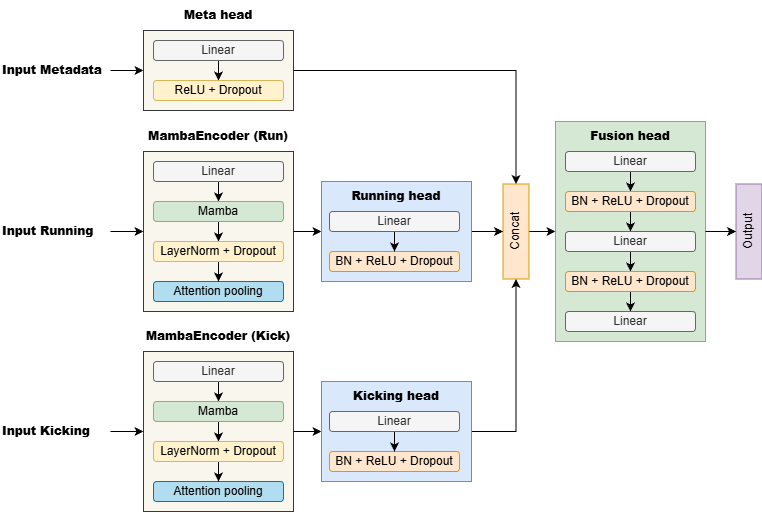

# Paper: MambaKick: Early Penalty Direction Prediction from HAR Embeddings

The overall architecture of the proposed MambaKick.
 
 <br>

# Code and dataset
Code for training is available on the Kaggle platform:
https://www.kaggle.com/code/hvelesaca/har-penalty-direction-prediction/

# Citation

If you use this paper, please cite us, 

```
@article{velesaca2026penalty,
  title={MambaKick: Early Penalty Direction Prediction from HAR Embeddings},
  author={Velesaca, Henry O and Freire-Obregón, David, Reyes-Angulo, Abel and Araujo Steven, and Sappa Angel},
  journal={International Conference on Innovations in Computational Intelligence and Computer Vision},
  pages={1--16},
  year={2026},
  publisher={Springer}
}
``` 
